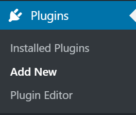

# Blog on NextJs (React) + WordPress

Blog. You can run a blog through the WordPress admin panel. WordPress is converted into a Headless CMS using plugins and serves for content management without a frontend component.
The frontend is done in NextJs(React) with TailwindCSS and MaterialUI. Data transfer: GraphQL.
The current implementation allows you to separate the frontend and backend on different servers and have multiple frontend applications based on a single WordPress.

## Demo

### [https://dji.zhu.by/](https://dji.zhu.by/)

## Installation

1. Clone the repository:

```bash
git clone https://github.com/Zhuk-off/RDji-blog.git`.
```

2. Navigate to the project directory:

```bash
cd RDji-Fiverr-review
```

3. Install dependencies:

```bash
npm install
```

## Configuration

### Step 1. Prepare your WordPress site

First, you need a WordPress site. There are many solutions for WordPress hosting, such as [WP Engine](https://wpengine.com/) and [WordPress.com](https://wordpress.com/).

You will need the following plugins to work properly.
Install them in your WordPress.

1. [WPGraphQL](https://ru.wordpress.org/plugins/wp-graphql/) - A plugin to access basic WordPress functionality via GraphQL

2. [Headless CMS](https://codeytek.com/headless-cms-wordpress-plugin/) - Plugin for easy header and footer management via REST API

3. [Yoast SEO](https://ru.wordpress.org/plugins/wordpress-seo/) - Plugin for SEO optimization of your site

4. [Add WPGraphQL SEO](https://ru.wordpress.org/plugins/add-wpgraphql-seo/) - Plugin to access Yoast SEO via GraphQL

5. [Advanced Custom Fields](https://ru.wordpress.org/plugins/advanced-custom-fields/) - A plugin that will allow you to use custom fields.

6. [WPGraphQL for Advanced Custom Fields](https://www.wpgraphql.com/acf) - Plugin to access Advanced Custom Fields plugin via GraphQL

#### Customize client and server side

Let's separate the client and server parts in WordPress so that there are no conflicts.
The best option I can suggest is :
Save the client part as our website address (https://zhu.by).
The server part will be saved as a subdomain (https://wordpress.zhu.by).

Option for deployment on the server:


Option for local server:


#### WPGraphQL

Once the site is ready, you'll need to install the [WPGraphQL](https://www.wpgraphql.com/) plugin. It will add GraphQL API to your WordPress site, which we'll use to query the posts. Follow these steps to install it:

- Download the [WPGraphQL repo](https://github.com/wp-graphql/wp-graphql) as a ZIP archive.
- Inside your WordPress admin, go to **Plugins** and then click **Add New**.



- Click the **Upload Plugin** button at the top of the page and upload the WPGraphQL plugin.


- Once the plugin has been added, activate it from either the **Activate Plugin** button displayed after uploading or from the **Plugins** page.


The [WPGraphQL](https://www.wpgraphql.com/) plugin also gives you access to a GraphQL IDE directly from your WordPress Admin, allowing you to inspect and play around with the GraphQL API.


#### Headless CMS Plugin

Allows us to create menus for header and footer.

Create a menu for the header and footer of your site. To do this, go to the menu of your WordPress site Appearance -> Menus

Example of working with the plugin:


### Step 2. Populate Content

Inside your WordPress admin, go to **Posts** and start adding new posts:

- We recommend creating at least **2 posts**
- Use dummy data for the content
- Pick an author from your WordPress users
- Add a **Featured Image**. You can download one from [Unsplash](https://unsplash.com/)
- Fill in the **Excerpt** field


When you're done, make sure to **Publish** the posts.

> **Note:** Only **published** posts and public fields will be rendered by the app unless [Preview Mode](https://nextjs.org/docs/advanced-features/preview-mode) is enabled.


### Step 3. Set up environment variables

Copy the `.env.local.example` file in this directory to `.env.local` (which will be ignored by Git):

```bash
cp .env.local.example .env.local
```

Then open `.env.local` and set `WORDPRESS_API_URL` to be the URL to your GraphQL endpoint in WordPress. For example: `https://zhu.by/graphql`.

Your `.env.local` file should look like this:

```bash
WORDPRESS_API_URL="https://wordpress.zhu.by/graphql"

NEXT_PUBLIC_WORDPRESS_SITE_URL=https://wordpress.zhu.by
NEXT_PUBLIC_SITE_URL=https://zhu.by
# or for local development, use
# NEXT_PUBLIC_SITE_URL=http://localhost:3000

#To track visitors through Google Analytics and Yandex Metrika, use the IDs you have received in your Google and Yandex user account
NEXT_PUBLIC_GA_ID=G-...
NEXT_PUBLIC_YM_ID=...

# Feedback form
PASS=...
LOGIN=example@gmail.com

# ReCaptcha
NEXT_PUBLIC_RECAPTCHA_SITE_KEY=...
RECAPTCHA_SECRET_KEY=...

# Only required if you want to enable preview mode
# WORDPRESS_AUTH_REFRESH_TOKEN=
# WORDPRESS_PREVIEW_SECRET=
```
You can learn more about how to work with ReCaptcha here [developers.google.com](https://developers.google.com/recaptcha?hl=ru) and [Integrating reCAPTCHA with Next.js](https://prateeksurana.me/blog/integrating-recaptcha-with-next/)

You can learn more about how to work with sending emails and how to get a password for an application from Google here [Nodemailer](https://nodemailer.com/about/)


### Step 4. Run Next.js in development mode

```bash

npm run dev

# or

yarn dev
```

Your blog should be up and running on [http://localhost:3000](http://localhost:3000)!

## Contacts

You can contact me by email: zhukoffweb@gmail.com
